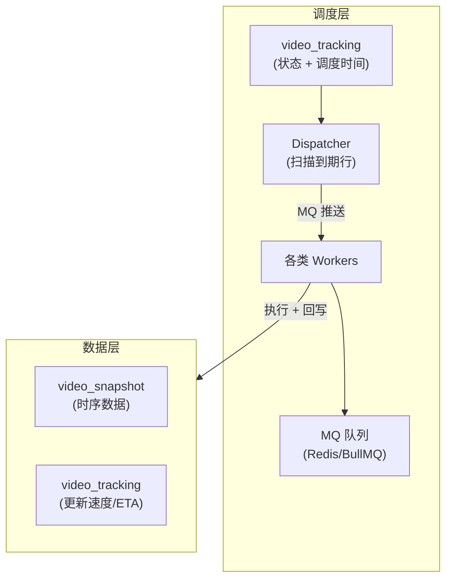
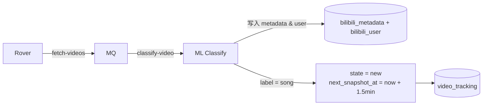
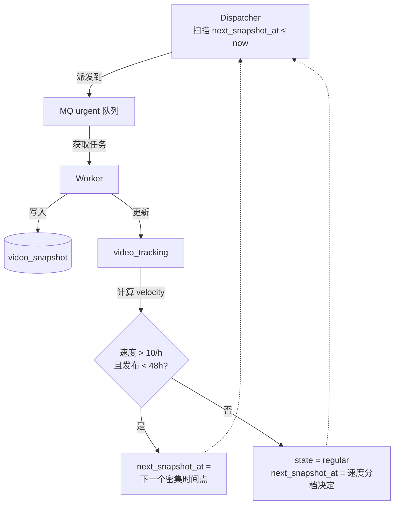
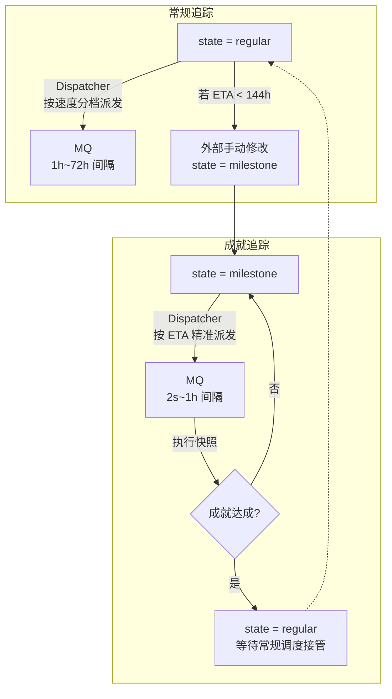
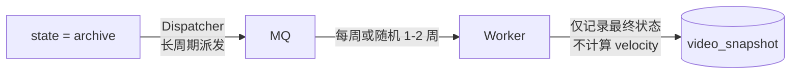

## 设计目标

新爬虫系统围绕以下核心目标构建：

| 目标 | 旧系统现状 | 新系统设计 |
|------|-----------|-----------|
| **分布式灾备** | 单机部署，单点故障即全系统瘫痪 | 单主多备，分钟级 RTO，主节点故障时 Standby 可自动接管 |
| **解耦数据依赖** | 所有节点必须直连完整 SnapshotDB | 节点可独立运行，仅需从 S3 拉取最小数据集即可恢复服务 |
| **显式状态机** | 状态隐式推断，外部无法干预 | 状态显式声明，支持手动提升/降级追踪优先级 |
| **强可测试性** | 调度逻辑埋藏在 SQL 和业务代码中 | 调度算法纯函数化，支持历史数据回归测试 |
| **强可观测性** | 指标收集几乎不可用 | 指标 + 日志 + 链路追踪三驾马车 |
| **配置热更新** | 代理配置硬编码，需重启生效 | 支持通过外部接口更改配置 |

## 架构总览

新系统采用**状态驱动调度**架构，核心数据流向：

关键转变：**Worker 不再消费预注册的调度行，而是消费由 Dispatcher 动态派发的任务。调度 = 修改 `video_tracking.next_snapshot_at`，执行 = Worker 取回结果并重新计算下一次调度时间。**

## 节点角色

系统定义三类节点，运行相同代码库但职责不同：

### Master

**唯一性**：任何时刻集群中只有一个 Master。通过分布式锁（S3 条件写入）保证。

**职责边界**：
- 持有完整的 `video_tracking` 表（当前追踪的所有视频 ID 及状态）
- 持有至少最近 3-7 天的历史快照（用于速度计算和 ETA 估计）
- 执行 Rover（视频发现）、Dispatcher（任务派发）、各类 Worker（任务执行）
- 运行内嵌 ML 服务（视频分类）
- 定期将最小数据集同步至 S3

**数据完整性**：Master 是 SnapshotDB 的唯一写入者（正常运行时）。

### Standby

**唯一性**：可同时存在多个 Standby，平时处于待命状态。

**职责边界**：
- 定期检测分布式锁状态（S3 poll）
- 锁失效时抢锁，抢锁成功则晋升为 Master
- 晋升为 Master 后从 S3 拉取数据集并恢复服务
- **检测到原 Master 重新上线时**：原 Master 会强制夺锁，Standby 检测到锁被夺回后降级回 Standby

**数据恢复**：原 Master 离线期间产生的数据 gaps 需要人工介入同步。

### Edge

**唯一性**：任意数量，不受锁机制约束。

**职责边界**：
- 仅执行快照任务，不执行发现或分类
- 不维护 `video_tracking` 表，不计算调度时间
- 可接收外部下发的快照任务（如特定视频的临时追踪）
- 快照数据提交至主后端

**使用场景**：临时扩容、特定视频的高频追踪、网络边缘部署。

## 核心数据流

以一个新发现视频的完整生命周期为例：

### 1. 发现与分类

### 2. 初始追踪

### 3. 常规与成就追踪

### 4. 存档追踪

## 与旧系统的关键差异

| 维度 | 旧系统 | 新系统 |
|------|--------|--------|
| **调度机制** | `snapshot_schedule` 表 = 状态 + 任务队列 | `video_tracking` 表 = 纯状态，MQ = 任务队列，Dispatcher 负责桥接 |
| **状态管理** | 隐式推断（由调度逻辑决定视频处于哪个"阶段"） | 显式声明（`state` 字段可读写，支持外部干预） |
| **架构模式** | 单体进程 + BullMQ | 分布式多节点 + 状态同步 |
| **数据依赖** | 所有操作依赖完整 SnapshotDB | 节点可从 S3 恢复最小数据集独立运行 |
| **调度算法** | 分散在各 Worker 中，难以测试 | 纯函数化（`evaluateState`），可回归测试 |
| **代理配置** | 硬编码，重启生效 | S3 配置文件，热加载 |
| **限流策略** | Redis 窗口计数 + 复杂回滚逻辑 | 负载感知调度（`currentLoad` 参数），算法内嵌限流 |

## S3 同步边界

Master 定期同步至 S3 的**最小数据集**包括：

- `video_tracking` 表全量（状态 + 调度时间 + 速度/ETA）
- `video_snapshot` 最近 7 天（用于速度计算的历史窗口）
- 所有需要追踪的视频 ID 列表

预估数据量：约 10 MB。

## RTO 与同步策略

- **目标 RTO**：< 5 分钟（从 Master 故障到 Standby 恢复服务）
- **同步频率**：Master 每 2 分钟同步至 S3
- **锁检测频率**：Standby 每 30 秒检测一次锁状态
- **数据 gaps 处理**：Standby 运行期间产生的快照数据，待原 Master 恢复后人工同步 reconciliation
